# Passagr Data Ingestion Pipeline — Audit Report
**Date:** 2026-02-27  
**Scope:** [workers/fetcher.ts](file:///Users/sarahsahl/Desktop/passagr/workers/fetcher.ts), [workers/extractor.ts](file:///Users/sarahsahl/Desktop/passagr/workers/extractor.ts), [workers/validator.ts](file:///Users/sarahsahl/Desktop/passagr/workers/validator.ts), [workers/differ.ts](file:///Users/sarahsahl/Desktop/passagr/workers/differ.ts), [workers/editorial_router.ts](file:///Users/sarahsahl/Desktop/passagr/workers/editorial_router.ts), [workers/publisher.ts](file:///Users/sarahsahl/Desktop/passagr/workers/publisher.ts), [workers/alert_writer.ts](file:///Users/sarahsahl/Desktop/passagr/workers/alert_writer.ts), [workers/freshness_scanner.ts](file:///Users/sarahsahl/Desktop/passagr/workers/freshness_scanner.ts), [workers/db.ts](file:///Users/sarahsahl/Desktop/passagr/workers/db.ts)

---

## State Diagram

```mermaid
stateDiagram-v2
    [*] --> Fetching : freshness_scanner enqueues URL

    Fetching --> DEAD_END_1 : HTTP error / unsupported content type\n(silent return, no state written)
    Fetching --> Extracting : source upserted, sourceId logged

    Extracting --> DEAD_END_2 : OpenAI failure\n(caught, silent return, no state written)
    Extracting --> Validating : extractedJson returned

    Validating --> Diffing : validationResult returned

    Diffing --> DEAD_END_3 : DB fetch of currentEntity fails\n(returns null, pipeline halts)
    Diffing --> DEAD_END_4 : No changes detected\n(returns null, valid but silent stop)
    Diffing --> EditorialRouting : differOutput returned

    EditorialRouting --> PendingReview : change_type=add OR impact=high OR critical field touched
    EditorialRouting --> AutoPublish_Medium : impact=medium (currently TODO stub)
    EditorialRouting --> AutoPublish_Low : impact=low (currently TODO stub)

    PendingReview --> [*] : awaits human; no timeout or escalation path

    AutoPublish_Medium --> Publishing : (not yet implemented)
    AutoPublish_Low --> Publishing : (not yet implemented)

    Publishing --> PARTIAL_STATE : upsert succeeds, changelog INSERT fails\n(entity published, audit trail lost)
    Publishing --> Published : both writes succeed

    Published --> AlertWriting : (only for medium/high impact)
    AlertWriting --> [*] : alert logged (no actual delivery guaranteed)
```



> **Legend:** `DEAD_END_*` = pipeline silently terminates with no persisted failure state. `PARTIAL_STATE` = database in an inconsistent condition.

---

## Audit Findings

---

### 1. State Machine Integrity

#### FINDING 1.1 — CRITICAL: Queue hand-offs are simulated/commented out; pipeline is not actually wired together

**Files:** `fetcher.ts:172`, `extractor.ts:107`, `validator.ts:170`, `editorial_router.ts:86,90`

Every stage-to-stage hand-off is a commented-out stub:
```ts
// `await extractAgent.enqueue({ sourceId: newSourceId, ... });`  // fetcher.ts:172
// `await validatorAgent.enqueue({ entityJson: extractedJson });`  // extractor.ts:107
// TODO: Enqueue Publisher and Alert Writer                        // editorial_router.ts:86,90
```
There is **no queue, no job runner, no event bus**. Stages cannot flow into each other in production. The entire pipeline is a collection of independently callable functions with no glue.

**Risk:** The system writes to `sources` and `editorial_reviews` but will never reach [publisher.ts](file:///Users/sarahsahl/Desktop/passagr/workers/publisher.ts) under any automatic workload. Data can be fetched, sourced, and validated with zero chance of it ever being published without manual invocation.

**Severity:** 🔴 CRITICAL

---

#### FINDING 1.2 — HIGH: `PendingReview` state has no timeout, escalation, or expiry

**File:** `editorial_router.ts:65–78`

Records are `INSERT`ed into `editorial_reviews` with `status = 'pending'` and never re-examined. There is no:
- TTL / expiry mechanism
- Escalation path if a review sits unclaimed
- Mechanism to re-trigger the pipeline after a human approves

**Risk:** New entities and critical-field changes queue up indefinitely. If an editor doesn't notice, data is never published. There is also no mechanism to re-run the publisher after approval.

**Severity:** 🟠 HIGH

---

#### FINDING 1.3 — HIGH: `remove` change type is declared but never routed

**File:** `differ.ts:52`, [editorial_router.ts](file:///Users/sarahsahl/Desktop/passagr/workers/editorial_router.ts)

[differ.ts](file:///Users/sarahsahl/Desktop/passagr/workers/differ.ts) declares `change_type` as `'add' | 'update' | 'remove'` but the `'remove'` branch is never assigned (no code path sets it). If a removal were ever introduced, [editorial_router.ts](file:///Users/sarahsahl/Desktop/passagr/workers/editorial_router.ts) does not handle it — it only checks `change_type === 'add'` and falls through to the `impact`-based branches, meaning a removal could auto-publish as a low/medium change with no review gate.

**Severity:** 🟠 HIGH

---

#### FINDING 1.4 — MEDIUM: [freshness_scanner.ts](file:///Users/sarahsahl/Desktop/passagr/workers/freshness_scanner.ts) only checks a single hardcoded policy per entity type

**File:** `freshness_scanner.ts:41–42, 70–71`

The scanner finds the `abortion_access_status` policy for countries and the `fees` policy for visa paths — even though many other fields have their own freshness TTLs presumably in `freshness_policies`. All other policies are silently ignored.

**Risk:** A country whose `lgbtq_rights_index` or `hate_crime_law_snapshot` has gone stale may never be re-fetched if `abortion_access_status` is still within TTL.

**Severity:** 🟡 MEDIUM

---

### 2. Atomicity of Publish

#### FINDING 2.1 — CRITICAL: Publisher writes are **not** in a transaction; partial publish is possible

**File:** `publisher.ts:165–190`

The publisher performs two sequential, independent Supabase writes:
1. `upsert` the entity row (line 165)
2. `insert` into `changelogs` (line 176)

These run as separate HTTP calls to the Supabase REST API. If the process is killed, the network fails, or the changelogs insert throws, the entity is live in the database **with no audit trail**. There is no rollback.

```ts
// Write 1 – publishes entity (irreversible without a second write)
const { data: updatedEntity, error: upsertError } = await dbClient
    .upsert(upsertPayload, { onConflict: 'id' }).select().single();

// Write 2 – if this fails, entity is published but changelog is missing
const { error: changelogError } = await supabase
    .from('changelogs').insert({ ... });

if (changelogError) {
    console.error("Failed to write changelog:", changelogError);
    // ← error is logged but NOT thrown; execution continues
}
```

**Risk:** Silent data integrity loss. Published entities with missing changelogs break audit history and any downstream feature that relies on `changelogs` (dashboards, user-facing "what changed" views).

**Recommended fix:** Use a Postgres function/RPC that wraps both writes in a single `BEGIN … COMMIT` block called via `supabase.rpc()`.

**Severity:** 🔴 CRITICAL

---

#### FINDING 2.2 — HIGH: [normalizeEntityForPublish](file:///Users/sarahsahl/Desktop/passagr/workers/publisher.ts#13-135) silently returns `null` for unknown entity types

**File:** `publisher.ts:133`

If `entity.entity_type` is unrecognized (e.g., `'requirement'`, `'step'`, `'cost_item'`, `'city'` — all of which the `tableMap` supports but [normalizeEntityForPublish](file:///Users/sarahsahl/Desktop/passagr/workers/publisher.ts#13-135) does not have a `return` branch for — wait: actually `requirement`, `step`, `cost_item`, `city` and `source` **do** have branches (lines 66–131), but if a new entity type is added to `tableMap` without a corresponding normalize branch, the function returns `null` and the publisher silently exits at line 163. There is no log of failure, no error state, and no dead-letter queue.

**Severity:** 🟠 HIGH  

---

### 3. Diff Correctness

#### FINDING 3.1 — HIGH: [differ.ts](file:///Users/sarahsahl/Desktop/passagr/workers/differ.ts) diffs raw DB row vs. proposed entity — structural mismatches produce noise

**File:** `differ.ts:61`

```ts
const diffs = deepdiff.diff(currentEntity, proposedEntity);
```

`currentEntity` is fetched from DB with `SELECT *` (all columns, including system columns like `created_at`, `updated_at`, internal UUIDs, etc.). `proposedEntity` comes from the LLM extractor and contains only the fields it was prompted to fill. **Every missing system column will appear as a `D` (deleted) diff**, producing false positives that clog the editorial queue and inflate `diff_fields`.

**Risk:** Reviewers see noise; critical real changes may be overlooked. Auto-publish thresholds may mis-fire because `diff_fields.length` is inflated.

**Recommended fix:** Normalize both sides to the same field set before diffing, or restrict `SELECT` in the DB query to only the fields present in the entity schema.

**Severity:** 🟠 HIGH

---

#### FINDING 3.2 — MEDIUM: Array changes are opaquely logged as `'array_change'`

**File:** `differ.ts:76–78`

```ts
} else if (d.kind === 'A') { // Array
    from = 'array_change';
    to = 'array_change';
}
```

When a `fees` array or `eligibility` array changes, the diff entry contains no actionable data — just the string `'array_change'`. Editors reviewing `diff_fields` cannot tell what changed (e.g., a fee amount vs. a new fee being added vs. a fee being removed).

**Severity:** 🟡 MEDIUM

---

#### FINDING 3.3 — LOW: No whitespace/formatting normalization before diff

**File:** `differ.ts:61`

Text fields like `healthcare_overview`, `rights_snapshot`, `tax_snapshot` are long prose strings. If the LLM extractor re-phrases or reformats with different whitespace, trailing newlines, or Unicode normalization, `deepdiff` will report an `'E'` (edit) on those fields and potentially route them to the editorial queue as "changes" when the semantic content is identical.

**Severity:** 🟢 LOW (cosmetic noise; not a safety risk, but increases reviewer burden)

---

### 4. Editorial Routing Logic

#### FINDING 4.1 — HIGH: Auto-publish branches are `TODO` stubs — editorial routing never completes

**File:** `editorial_router.ts:86, 90`

```ts
} else if (impact === 'medium') {
    console.log(`Medium impact. Auto-publishing...`);
    // TODO: Enqueue Publisher and Alert Writer  ← STUB
} else { // impact === 'low'
    console.log(`Low impact. Auto-publishing...`);
    // TODO: Enqueue Publisher                  ← STUB
}
```

Both auto-publish paths are stubs. Non-critical low/medium changes are never actually published. The function returns an object saying `action: 'auto_publish'`, but no publish ever happens.

**Severity:** 🔴 CRITICAL (functionally, nothing auto-publishes)

---

#### FINDING 4.2 — MEDIUM: No catch-all / default branch for unrecognized `impact` values

**File:** `editorial_router.ts:83–91`

The routing logic is:
- `requiresHumanReview` → review queue
- `else if (impact === 'medium')` → auto-publish + alert stub
- `else` → low-impact auto-publish stub

If `validationResult.impact` is anything other than `'low'`, `'medium'`, or `'high'` (e.g., `undefined`, `null`, or a malformed value), it falls into the `else` branch and is treated as low-impact, bypassing review. There is no guard.

**Severity:** 🟡 MEDIUM

---

#### FINDING 4.3 — MEDIUM: [isCriticalFieldChange](file:///Users/sarahsahl/Desktop/passagr/workers/editorial_router.ts#31-40) uses string `.includes()` — vulnerable to partial path matches

**File:** `editorial_router.ts:33–38`

```ts
return CRITICAL_SAFETY_FIELDS.some(criticalField =>
    diff.field.includes(criticalField)
);
```

This uses `String.includes`, so a field named `fees_description` would match the critical field `fees`, and `processing_time_range_notes` would match `processing_time_range`. This produces false positives that route innocuous changes to the review queue.

Conversely, if a nested path like `fees[0].amount` is stored as `fees.0.amount` in the field path, `.includes('fees')` would catch it — which is actually correct behavior for `fees`, but could produce unintended matches for other field names.

**Recommended fix:** Use exact equality or prefix match with a `.` separator: `diff.field === criticalField || diff.field.startsWith(criticalField + '.')`.

**Severity:** 🟡 MEDIUM

---

#### FINDING 4.4 — LOW: `editorial_reviews` INSERT has no `RETURNING` id — no way to link to downstream state

**File:** `editorial_router.ts:65–78`

The `INSERT INTO editorial_reviews ...` query does not return the new row's ID. There's no way to reference this specific review record from downstream systems (e.g., when a human approves it, what does the approval hook reference to trigger publishing?).

**Severity:** 🟢 LOW

---

### 5. Worker Concurrency

#### FINDING 5.1 — CRITICAL: No distributed lock or claim mechanism — double-publish is trivially possible

**Files:** All workers

There is no advisory lock, row-level lock (`SELECT FOR UPDATE`), or idempotency key anywhere in the pipeline. If two worker instances are triggered simultaneously with the same entity (e.g., two overlapping cron runs, or a freshness scan and a manual re-trigger):

1. Both fetch the same `currentEntity` from DB
2. Both compute the same diff
3. Both route to `editorial_router` independently
4. Both call [publisher.ts](file:///Users/sarahsahl/Desktop/passagr/workers/publisher.ts) independently — resulting in two `changelogs` entries and potentially two conflicting upserts with different `last_published_at` timestamps racing each other

The Supabase upsert on [id](file:///Users/sarahsahl/Desktop/passagr/workers/fetcher.ts#35-59) conflict means the entity row itself won't duplicate, but:
- `changelogs` will have duplicate entries
- If the two publishes normalize slightly differently (e.g., different `now` timestamps), the final state is non-deterministic

**Recommended fix:** Use a Postgres advisory lock or a `claimed_at` column on the `editorial_reviews` / job queue row with a `SELECT ... FOR UPDATE SKIP LOCKED` pattern.

**Severity:** 🔴 CRITICAL

---

#### FINDING 5.2 — HIGH: [differ.ts](file:///Users/sarahsahl/Desktop/passagr/workers/differ.ts) and [editorial_router.ts](file:///Users/sarahsahl/Desktop/passagr/workers/editorial_router.ts) each instantiate a new [createPgPool()](file:///Users/sarahsahl/Desktop/passagr/workers/db.ts#11-33) at module load

**File:** `differ.ts:5`, `editorial_router.ts:4`

```ts
const pool = createPgPool(); // module-level, re-created per Worker invocation in serverless
```

In a serverless/short-lived worker model, each invocation creates a new pool. While `pg.Pool` manages connections internally, in high-concurrency scenarios this can exhaust the Postgres connection limit. The pool max is `10` (configurable), but with many concurrent workers, each creating its own pool of up to 10, connection exhaustion is likely.

**Severity:** 🟠 HIGH

---

### 6. Failure Handling

#### FINDING 6.1 — HIGH: No retries anywhere in the pipeline

**Files:** `fetcher.ts:103`, `extractor.ts:109`, `differ.ts:46–49`, `editorial_router.ts:80–82`

Every failure path is a `console.error` + `return`. There are no retries, no backoff, no dead-letter queue, no persistent error state. A transient network failure during fetch, an OpenAI rate-limit error during extraction, or a Postgres timeout during diffing silently drops the work item.

```ts
// fetcher.ts – HTTP error handling
if (!response.ok) {
    console.error(`HTTP error! Status: ${response.status}`);
    // In a real system, we'd handle this more gracefully, perhaps with retries.
    return; // ← silent drop
}
```

**Risk:** Transient failures cause permanent data loss. There is no way to identify which items were silently dropped without tailing logs.

**Severity:** 🟠 HIGH

---

#### FINDING 6.2 — HIGH: [fetcher.ts](file:///Users/sarahsahl/Desktop/passagr/workers/fetcher.ts) does not persist failure state to the database

**File:** `fetcher.ts:101–104, 141–144, 160–163`

On HTTP error, storage failure, or DB upsert failure, [fetcher.ts](file:///Users/sarahsahl/Desktop/passagr/workers/fetcher.ts) logs and returns. No failure record, no `status = 'failed'` in the `sources` table, no alert. The URL will be re-queued only if `freshness_scanner` picks it up again on the next scan cycle.

**Severity:** 🟠 HIGH

---

#### FINDING 6.3 — MEDIUM: [extractor.ts](file:///Users/sarahsahl/Desktop/passagr/workers/extractor.ts) passes only `source.excerpt` to the LLM, not the full content

**File:** `extractor.ts:80`

```ts
Text content: ${source.excerpt}
```

The `excerpt` is what `Readability` extracted as a short summary. For extraction of structured fields like `fees`, `processing_min_days`, or `lgbtq_rights_index`, the excerpt is almost certainly too short. The full HTML content is stored in Supabase Storage but is never retrieved for extraction.

**Risk:** LLM will hallucinate or return `null` for most fields because the excerpt doesn't contain the full data. Downstream `impact: 'high'` validation errors for missing fields will be the norm rather than the exception.

**Severity:** 🟡 MEDIUM

---

#### FINDING 6.4 — LOW: [validator.ts](file:///Users/sarahsahl/Desktop/passagr/workers/validator.ts)'s [checkNullFields](file:///Users/sarahsahl/Desktop/passagr/workers/validator.ts#142-152) throws on arrays with `length === 0`

**File:** `validator.ts:145`

```ts
if (obj[key] === null || obj[key].length === 0) {
```

Accessing `.length` on a non-array, non-string value (e.g., a number like `lgbtq_rights_index = 0`) will return `undefined`, not throw — but for `lgbtq_rights_index === 0`, `obj[key].length` is `undefined` which is falsy, so 0 (a valid index value) would also be flagged as a warning. This produces a false warning: **`lgbtq_rights_index` of `0` is valid** but will be reported as "null or empty."

**Severity:** 🟢 LOW

---

### 7. Alerting

#### FINDING 7.1 — HIGH: [alert_writer.ts](file:///Users/sarahsahl/Desktop/passagr/workers/alert_writer.ts) generates no alerts for failed publishes or dropped items

**File:** [alert_writer.ts](file:///Users/sarahsahl/Desktop/passagr/workers/alert_writer.ts)

The alert writer is only ever called (per the editorial_router stub) for medium/high impact **successful** publishes. There are zero alerts for:
- Fetch failures
- Extraction failures
- Validation failures that block publishing
- Editorial reviews that have been pending for > N days
- Publisher partial-write failures (entity published, changelog missing)
- Pipeline complete stalls

**Severity:** 🟠 HIGH

---

#### FINDING 7.2 — HIGH: [alert_writer.ts](file:///Users/sarahsahl/Desktop/passagr/workers/alert_writer.ts) never actually sends notifications

**File:** `alert_writer.ts:28–30`

```ts
console.log("Alerts generated:", alertOutput);
// In a real system, this would trigger email, Slack, or other notification services.
```

Alert delivery — email, Slack, PagerDuty, anything — is a stub. The only observable output is a `console.log`. There is no integration with any notification service.

**Severity:** 🟠 HIGH

---

#### FINDING 7.3 — MEDIUM: Alert text has a hard 200-char truncation that can hide critical change details

**File:** `alert_writer.ts:24–25`

```ts
notification: notificationText.slice(0, 200),
email_summary: emailSummaryText.slice(0, 200)
```

For entities with long names or summaries, the alert text is hard-truncated. An alert for a critical safety field change might be truncated mid-sentence, losing context about which field changed and what the old/new values were.

**Severity:** 🟡 MEDIUM

---

#### FINDING 7.4 — MEDIUM: [alert_writer.ts](file:///Users/sarahsahl/Desktop/passagr/workers/alert_writer.ts) uses `entity.name || entity.iso2` — fails for entity types without either field

**File:** `alert_writer.ts:18`

```ts
const entityName = entity.name || entity.iso2;
```

Entity types like `step`, `cost_item`, `requirement` don't have a `name` or `iso2` field. `entityName` will be `undefined`, producing alert text like: `"A change has been published for undefined step: ..."`.

**Severity:** 🟡 MEDIUM

---

## Prioritized Summary Table

| # | File | Finding | Severity | Impact |
|---|------|---------|----------|--------|
| 1 | All workers | Queue hand-offs are commented-out stubs — pipeline never flows end-to-end | 🔴 CRITICAL | Nothing auto-publishes |
| 2 | `editorial_router.ts:86,90` | Auto-publish branches are stubs — no publish ever fires | 🔴 CRITICAL | Nothing auto-publishes |
| 3 | `publisher.ts:165–190` | No transaction — partial publish leaves entity live with no changelog | 🔴 CRITICAL | Data integrity |
| 4 | All workers | No distributed lock — double-publish race condition on concurrent workers | 🔴 CRITICAL | Duplicate changelogs, non-deterministic state |
| 5 | `differ.ts:61` | Raw `SELECT *` diffed against LLM output — structural noise in every diff | 🟠 HIGH | Reviewer overload, false positives |
| 6 | `differ.ts:52` / [editorial_router.ts](file:///Users/sarahsahl/Desktop/passagr/workers/editorial_router.ts) | `'remove'` change type unimplemented and unrouted | 🟠 HIGH | Deletions would auto-publish unreviewed |
| 7 | [editorial_router.ts](file:///Users/sarahsahl/Desktop/passagr/workers/editorial_router.ts) | `PendingReview` has no timeout, escalation, or re-trigger after approval | 🟠 HIGH | Data permanently stuck |
| 8 | All workers | No retries on transient errors — failures silently drop work items | 🟠 HIGH | Silent data loss |
| 9 | [alert_writer.ts](file:///Users/sarahsahl/Desktop/passagr/workers/alert_writer.ts) | No alerts for failed/dropped pipeline states | 🟠 HIGH | Zero observability on failures |
| 10 | [alert_writer.ts](file:///Users/sarahsahl/Desktop/passagr/workers/alert_writer.ts) | No actual notification delivery — all stubs | 🟠 HIGH | Alerts never reach humans |
| 11 | `differ.ts:5`, `editorial_router.ts:4` | Module-level pool creation — connection exhaustion at scale | 🟠 HIGH | DB overload under concurrent load |
| 12 | `extractor.ts:80` | Only excerpt sent to LLM, not full content | 🟡 MEDIUM | High miss rate on field extraction |
| 13 | `editorial_router.ts:33–38` | `String.includes()` for critical field matching — partial path false positives | 🟡 MEDIUM | Noisy review queue |
| 14 | `editorial_router.ts:83` | No guard for `impact === undefined/null` — falls through to low-impact auto-publish | 🟡 MEDIUM | Could bypass review on malformed input |
| 15 | `differ.ts:76–78` | Array diffs logged as `'array_change'` — no actionable detail | 🟡 MEDIUM | Reviewers blind to array contents |
| 16 | `freshness_scanner.ts:41,70` | Single hardcoded policy checked per entity type — other TTLs ignored | 🟡 MEDIUM | Stale safety data not re-fetched |
| 17 | `alert_writer.ts:24–25` | Hard 200-char truncation on alert text | 🟡 MEDIUM | Truncated critical change details |
| 18 | `alert_writer.ts:18` | `entity.name \|\| entity.iso2` undefined for step/cost_item/requirement | 🟡 MEDIUM | Garbled alert text |
| 19 | `validator.ts:145` | `.length === 0` check false-warns for numeric `0` (e.g., valid `lgbtq_rights_index = 0`) | 🟢 LOW | False validation warnings |
| 20 | `differ.ts:61` | No whitespace normalization — cosmetic text changes enter editorial queue | 🟢 LOW | Reviewer noise |
| 21 | `editorial_router.ts:65–78` | `INSERT editorial_reviews` has no `RETURNING id` | 🟢 LOW | No approval-to-publish linkage |

---

## Recommended Priority Order for Fixes

1. **Wire the queue** (Finding 1.1) — implement a real job queue (e.g., Supabase `pg_cron` + `pg_notify`, BullMQ, or Inngest) to connect stages.
2. **Implement auto-publish stubs** (Finding 4.1) — the two `TODO` branches must call `publisher.handler()`.
3. **Wrap publish in a transaction** (Finding 2.1) — use `supabase.rpc('publish_entity', {...})` backed by a plpgsql function with `BEGIN/COMMIT`.
4. **Add distributed locking** (Finding 5.1) — `SELECT FOR UPDATE SKIP LOCKED` on a job queue row, or Postgres advisory locks.
5. **Add retries with exponential backoff** (Finding 6.1) — at minimum for fetcher (HTTP) and extractor (OpenAI).
6. **Fix diff normalization** (Finding 3.1) — restrict `SELECT` to schema fields only; normalize before diffing.
7. **Implement alert delivery** (Finding 7.2) — connect to Slack webhook / email; add failure alerts for every terminal error state.
8. **Handle `remove` change type** (Finding 1.3) — route to mandatory human review.
9. **Fix pending review lifecycle** (Finding 1.2) — add `claimed_at`, `expires_at`, and a post-approval trigger for publisher.
10. **Fix `freshness_scanner` policy loop** (Finding 1.4) — iterate all policies, not just one hardcoded key.
